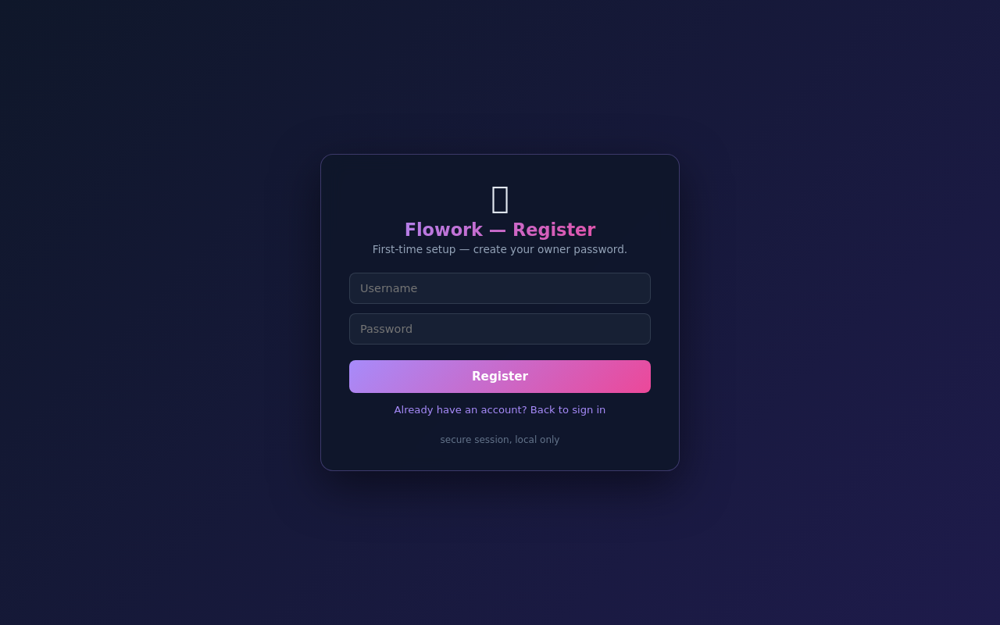

<div align="center">

# 🖥️ Flowork OS

### A sovereign computer in your pocket. Plug a USB into any PC → it boots straight into Flowork → unplug → zero trace on the host.

*The Live-USB / appliance build of the Flowork agent + router — now consolidated in the
[Flowork monorepo](https://github.com/flowork-os/flowork).*

</div>

---

Flowork OS turns Flowork from "an app you install" into a **self-contained, sovereign operating
system**. A minimal Linux boots directly to the Flowork control panel in a chromium kiosk, with
the agent (`:1987`) and sovereign router (`:2402`) running as system services. No desktop, no
host-disk writes, no data leaving the box.

> **Status: P0–P4 verified, single-USB product image builds & boots (BIOS+UEFI) — ✅.** Boots straight to the Flowork kiosk; a
> **LUKS-encrypted DATA volume** persists state; an **app sandbox** (bubblewrap) confines Python + Go
> apps; **signed-update verification** (anti-MITM); a read-only **squashfs root + tmpfs overlay** with
> **dm-verity enforced at boot** (a tampered root is refused); **A/B auto-update** with an atomic switch
> and **automatic rollback**; and **local AI** — Ollama runs a **Qwen model on-device, offline**
> (loopback-only, sovereign), and the **router routes chat to it** automatically. Full chain of trust:
> signed root hash → verity-verified root → sandboxed apps → encrypted data, with a local LLM
> (router-wired) and atomic rollback-safe updates. See [`docs/STATUS.md`](docs/STATUS.md),
> [`docs/BACKLOG.md`](docs/BACKLOG.md), [`docs/DESIGN.md`](docs/DESIGN.md).

<div align="center">



*P0 verified: the Flowork control panel, rendered full-screen by the on-device chromium kiosk after an unattended boot in QEMU.*

</div>

## Why this exists
- **Sovereignty.** Local router + (P2) local LLM → prompts and data never leave the appliance.
- **Zero-trace.** Ephemeral boot runs entirely in RAM; the host's disk is never touched.
- **Trust as a moat.** Read-only, (P3) verified-boot system that can't be silently hijacked —
  something a data-collecting cloud can't offer.

## Build & run (P0)
Requirements on the build host: `docker`, `go`, `mksquashfs`, `gzip`, `cpio` (ISO step also wants
`grub-mkrescue` + `xorriso`). **No root/apk needed** — the Alpine userland is built inside docker.

```sh
build/build-flowork-os.sh     # -> out/flowork-os-<ver>.{vmlinuz,initramfs.gz,rootfs.squashfs,iso}
build/run-qemu.sh             # boot it headless; verifies agent+router up; screenshots the kiosk

# P1 persistence (encrypted DATA volume):
build/make-data-disk.sh       # -> out/flowork-data.img (blank; LUKS-initialized on first boot)
build/verify-p1.sh            # boots twice on the same disk; asserts state survives the reboot

# P3a app sandbox (bubblewrap; Python + Go confined):
build/verify-p3a.sh           # boots with flowork.selftest=1; asserts apps run confined, owner state isolated

# Hardening primitives (security cores; boot-integration is deferred, see BACKLOG):
build/verify-p4a.sh           # signed-update verify: valid accepted, tampered/wrong-key rejected (anti-MITM)
build/verify-p3b.sh           # dm-verity: intact rootfs verified, tampered/wrong-hash rejected (needs root)

# Squashfs-root boot (the real USB product shape: read-only squashfs + tmpfs overlay):
build/verify-squashroot.sh    # boots out/<ver>.squashroot.iso via GRUB (-cdrom); asserts overlay root + agent + router
build/verify-verity.sh        # dm-verity AT BOOT: legit boots verified; a tampered system root is refused

# A/B auto-update (two slots + atomic switch + auto-rollback):
build/make-ab-disk.sh out <tag>   # -> out/<tag>.ab-disk.img (ext4: slot-a + slot-b + active pointer)
build/verify-ab.sh            # boot active slot, switch, confirm, and auto-rollback a bad/unconfirmed slot
build/verify-update.sh        # signed-install gate: a valid update installs+activates, a wrong-key one is refused

# Local AI (Ollama + Qwen, offline). Needs ollama + the model on the build host:
build/make-model-disk.sh out <tag> qwen2.5:0.5b   # -> out/<tag>.model-disk.img (ext4: Ollama model store)
build/verify-ollama.sh        # boot with NO network + the model disk; asserts an offline Qwen completion (+ router->ollama)

# Single flashable USB (GRUB BIOS+UEFI + A/B slots + model + DATA in one image):
build/make-usb-image.sh out <tag> qwen2.5:0.5b 6G  # -> out/<tag>.usb.img  (dd to a stick; needs root)
build/verify-usb.sh           # boots the image in QEMU (BIOS + UEFI) -> GRUB -> A/B -> agent up
# then on real hardware:  sudo dd if=out/<tag>.usb.img of=/dev/sdX bs=4M status=progress   (Secure Boot off)
```

`build-flowork-os.sh` resolves app source automatically: `$AGENT_SRC` / `$ROUTER_SRC` env →
sibling checkouts (`../Flowork_Agent`, `../Flowork-Router_personal`) → GitHub clone. So a bare
clone of this repo still builds.

## What the build does
```
1  static binaries   CGO_ENABLED=0 go build  ->  flowork-agent, flowork-router (static, musl-safe)
2  rootfs            docker alpine:3.20 + apk: linux-lts, cage, chromium, seatd, eudev, dbus, mesa
3  overlay           OpenRC services (agent/router/kiosk/health) + seed 34 agent definitions
4  kernel+initramfs  pack the whole rootfs as an ephemeral initramfs (RAM root) + extract kernel
5  squashfs + ISO    read-only rootfs (P1 base) + GRUB bootable ISO (USB-shaped)
```

## Layout
| Path | What |
|------|------|
| `build/build-flowork-os.sh` | One-command image build. |
| `build/run-qemu.sh` · `build/qmp.py` | Boot in QEMU + capture a framebuffer screenshot for verification. |
| `build/Dockerfile.rootfs` | The Alpine userland (kernel + Wayland kiosk stack). |
| `rootfs-overlay/` | OpenRC services for agent/router/kiosk/health + init config. |
| `docs/SPEC-P0.md` · `docs/PLAN-P0.md` · `docs/STATUS.md` | DEFINE → PLAN → verification record. |
| `docs/DESIGN.md` | Full architecture + roadmap (public). |

## Repos
- **This repo** — the OS/appliance builder (Flowork OS releases ship from here).
- `router/` — sovereign router engine (now in this monorepo; public releases at [flowork-os/flowork](https://github.com/flowork-os/flowork)).
- `agent/` — canonical agent engine (now in this monorepo; public releases at [flowork-os/flowork](https://github.com/flowork-os/flowork)).
- [`flowork_Router`](https://github.com/flowork-os/Flowork-OS) — canonical router engine.

## License
MIT — open source builds trust, and trust is the point. © 2026 Aola Sahidin.
